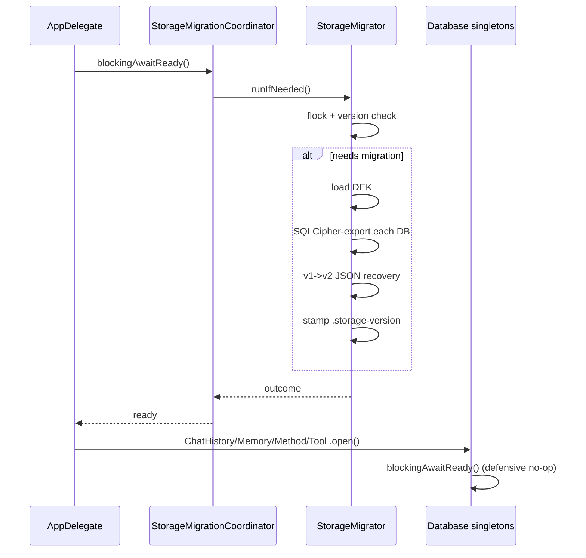

# Storage

Osaurus encrypts everything sensitive on disk — chats, memory, methods, tool indexes, plugin databases, and large attachments — with a per-device key kept in your macOS Keychain. Nothing leaves your Mac and nothing is readable by another user account, by Spotlight, or by Time Machine snapshots without the same Keychain entry.

This document covers what's encrypted, how the key is managed, what happens during the first-launch migration, and the user-facing controls in **Settings → Storage**.

---

## Table of Contents

- [Overview](#overview)
- [Getting Started](#getting-started)
- [What's Encrypted](#whats-encrypted)
- [Key Management](#key-management)
- [Migration](#migration)
- [Storage Settings](#storage-settings)
- [Background Maintenance](#background-maintenance)
- [Storage Paths Reference](#storage-paths-reference)
- [Limitations and Trade-offs](#limitations-and-trade-offs)

---

## Overview

Before 0.17.7, Osaurus persisted chat history, distilled memory, and several other artifacts as plaintext SQLite under `~/.osaurus/`. That made the data easy to inspect — and easy to exfiltrate. From 0.17.7 onward:

- Every SQLite database is opened through a vendored build of [SQLCipher 4.6.1](https://www.zetetic.net/sqlcipher/) and re-keyed with a 32-byte symmetric key.
- Large chat attachments (images and pasted documents) are spilled out of the SQLite TEXT column into AES-GCM-encrypted `.osec` files, content-addressed by SHA-256 so duplicates dedup automatically.
- The data-encryption key (DEK) lives in the macOS Keychain, scoped to your account on this device. It's not synced to iCloud by default and never leaves the machine.

The migration runs **once**, automatically, on the first launch of 0.17.7+. Existing users see a brief "Securing your data" overlay; new users see nothing because there's nothing to migrate.

---

## Getting Started

Nothing to configure. On the first launch of 0.17.7+:

1. Osaurus generates a fresh 32-byte key with `SecRandomCopyBytes` and persists it to your Keychain (you won't see a Touch ID prompt — see [Key Management](#key-management) below).
2. The migrator re-encrypts each SQLite database in place; originals are moved to `~/.osaurus/.pre-encryption-backup/` for one launch as a safety net.
3. The chat window unblocks once the migrator finishes. Typical duration is under a second per database; on a fresh install it's instant.

If you want to back up your data in plaintext (for example, before reinstalling macOS), open **Settings → Storage** → **Export plaintext backup**.

---

## What's Encrypted

| Artifact | Mechanism | On-disk location |
|---|---|---|
| Chat history | SQLCipher | `~/.osaurus/chat-history/history.sqlite` |
| Memory (identity, pinned facts, episodes, transcript, FTS5 mirrors) | SQLCipher | `~/.osaurus/memory/memory.sqlite` |
| Methods catalog | SQLCipher | `~/.osaurus/methods/methods.sqlite` |
| Tool index | SQLCipher | `~/.osaurus/tool-index/tool_index.sqlite` |
| Per-plugin databases | SQLCipher | `~/.osaurus/Tools/<plugin-id>/data/data.db` |
| Per-agent database (opt-in) | SQLCipher | `~/.osaurus/agents/<uuid>/db.sqlite` |
| Self-scheduling slots | SQLCipher | `~/.osaurus/scheduler.sqlite` |
| Large chat attachments | AES-GCM (`.osec`) | `~/.osaurus/chat-history/blobs/<sha256>.osec` |

**Attachment spillover.** Every `Attachment.image` or `Attachment.document` payload greater than or equal to **16 KB** is hashed, encrypted, and written to its own `.osec` file via [`AttachmentBlobStore`](../Packages/OsaurusCore/Storage/AttachmentBlobStore.swift). The chat row stores only `{ "ref": "<sha256>", ... }`, so resaving a session no longer rewrites every attachment byte. Smaller payloads (icons, short text snippets) stay inline in the row to avoid filesystem chatter.

**Plaintext, by design.** A few artifacts deliberately stay plaintext:

- JSON config under `~/.osaurus/config/`, `agents/`, `themes/`, `providers/`, `schedules/`, `watchers/`, `skills/`. The 0.17.7 migrator's v1 build briefly encrypted these and broke any consumer that read them as raw JSON; the v2 step recovers them. See [Migration](#migration).
- Plugin manifests under `~/.osaurus/sandbox-plugins/`.
- Vector index files under `~/.osaurus/memory/vectura/<agentId>/`. These are rebuilt from the encrypted SQLite source on demand; see [Limitations](#limitations-and-trade-offs).

---

## Key Management

The DEK is managed by [`StorageKeyManager`](../Packages/OsaurusCore/Identity/StorageKeyManager.swift).

### Storage

The DEK is a 32-byte raw `SymmetricKey` persisted as a Keychain generic password:

| Attribute | Value |
|---|---|
| `kSecAttrService` | `com.osaurus.storage` |
| `kSecAttrAccount` | `data-encryption-key` |
| Accessibility | `kSecAttrAccessibleAfterFirstUnlockThisDeviceOnly` |

### Why not biometric?

Unlike the Identity master key, the DEK is **not** wrapped behind Face/Touch ID. Every Osaurus launch — including background relaunches by `launchd`, Sparkle auto-updates, and watcher-driven wakeups — needs to open the encrypted databases without a user-facing prompt. `kSecAttrAccessibleAfterFirstUnlockThisDeviceOnly` means the key is available any time the user has unlocked the Mac at least once since boot, and is never copied off the device.

### Optional: derive from the master key

For users who want their DEK to be reproducible across devices via the iCloud-synced Identity master key, `StorageKeyManager.deriveFromMasterKey(context:)` replaces the Keychain entry with `HKDF-SHA256(masterKeyBytes, salt, "osaurus-storage-v1")`. The salt is persisted in two places:

- The Keychain (`com.osaurus.storage` / `data-encryption-salt`), bound to the device.
- A sidecar file at `~/.osaurus/.storage-key.salt` so the salt travels with the rest of the encrypted artifacts during a manual restore.

The salt by itself is harmless without the master key (HKDF is one-way). The master key fetch triggers a one-time biometric prompt; the derived DEK is then cached and behaves identically to a generated one.

### Cache

The DEK is cached in-process behind an `os_unfair_lock`. The first `currentKey()` call performs the Keychain read (and HKDF derivation, if applicable); subsequent calls return the cached value without IO. `wipeCache()` zeroes the cached bytes — used during graceful shutdown and after key rotation.

### Rotation and reset

| Operation | Effect |
|---|---|
| `rotate()` | Generate a fresh CSPRNG key, persist it to Keychain, return both old + new keys. Caller (the export service) is responsible for re-keying every database before unblocking the gate. |
| `install(key:)` | Replace the Keychain entry with a caller-provided key. Used inside `rotateStorageKey` so the rotation pipeline doesn't introduce a third key. |
| `wipeCache()` | Clear in-process cache only; Keychain entry remains. |
| `resetForWipe()` | Delete the Keychain key + salt + sidecar file and clear the cache. **Irreversible without the original key or a plaintext backup.** Used when the user explicitly wipes Osaurus state. |

---

## Migration

The migrator lives in [`StorageMigrator`](../Packages/OsaurusCore/Storage/StorageMigrator.swift). It is idempotent, version-stamped, and cross-process safe.

### Version history

| Target version | Steps |
|---|---|
| **v1** | SQLCipher-encrypt every SQLite database under `~/.osaurus/`. |
| **v2** | Restore any leftover `.osec` JSON files back to plaintext `.json`. v1 builds briefly encrypted JSON config too, but no consumer was wired to read `.osec`, which made `agents/`, `themes/`, and provider settings disappear from the UI. v2 walks the `~/.osaurus/` tree, decrypts each `.osec` JSON, and writes the plaintext sibling. v1 itself no longer encrypts JSON. |

The current target is **v2**. The current version stamp lives in `~/.osaurus/.storage-version`; if the file is missing or older than the target, the migrator runs and bumps it.

### Cross-process safety

`runIfNeeded` acquires an exclusive `flock(2)` on `~/.osaurus/.storage-migration.lock` for the duration of the run. If two Osaurus processes launch simultaneously (for example, app + CLI), the second one blocks on the lock, then re-reads the version stamp once it acquires it and exits early because the first process already migrated.

### Backup

Originals are moved (not copied) into `~/.osaurus/.pre-encryption-backup/`. This means there's a brief window where both the encrypted and plaintext databases exist on disk — important to know if you're trying to inspect storage state mid-migration. The backup directory is auto-cleaned on the **second** launch after a successful migration via `cleanupBackupIfStale()`. If the migration partially failed, the backup is kept until the user resolves the issue from **Settings → Storage**.

### Launch sequence

Every `*Database.shared.open()` call site also calls `blockingAwaitReady()` defensively, so plugin loaders or HTTP handlers that race the AppDelegate can never open a still-plaintext file with an encryption key set.

---

## Storage Settings

Open the Management window (`Cmd+Shift+M`) → **Storage**. The panel surfaces the migration outcome, lets you back up before risky operations, and recovers from key mismatches without losing data.

### Migration outcome card

Shows the most recent `StorageMigrator` run:

- Source and target version (e.g. `v0 -> v2`).
- Per-database success / failure counts.
- JSON files recovered by the v1→v2 step (only shown when non-zero).
- A pointer to `~/.osaurus/.pre-encryption-backup/` when a step failed, plus a hint to relaunch or export.

### Export plaintext backup

Writes a tarball of every encrypted artifact in plaintext to a folder you pick (Downloads by default). Use this **before**:

- Reinstalling macOS or migrating to a new Mac without a Time Machine restore.
- Rotating the storage key (the rotate confirmation dialog offers this as a one-click shortcut).
- Manually wiping Osaurus state.

Export does not delete or change anything on disk; you can run it as often as you want.

### Rotate storage key

Generates a fresh DEK and re-keys every registered database in place. The flow:

1. Confirmation alert (with a "Back up first" shortcut that runs the export).
2. `StorageMigrationCoordinator` flips `isMutating = true`, blocking new `blockingAwaitReady()` callers.
3. Every registered handle is closed via `withAllHandlesQuiesced`.
4. SQLCipher's `PRAGMA rekey` rewrites each database with the new key.
5. `EncryptedFileStore` artifacts are re-wrapped.
6. The new key is installed in the Keychain via `install(key:)`.
7. Handles reopen, gate clears.

The button is **disabled** when a core database fails the key-mismatch check — rotating in that state would destroy unreadable data.

### Key mismatch warnings

If a database on disk was written with a different DEK than the one currently in Keychain (most often after a Time Machine restore or manual `~/.osaurus/` copy), the panel shows:

- **Loud red card** for any of the four core databases. Rotation is disabled; user is directed to restore the right Keychain entry or import the matching plaintext backup.
- **Quiet warning card** for plugin databases, with a **Show details** list and a **Clean up orphaned plugin data** button. Plugins whose backing DB can't be decrypted are usually leftovers from an uninstalled or replaced plugin; cleaning them up deletes only the unreadable files.

### Idle state

When everything is healthy, the panel shows a green "Encrypted" badge and a single line: "All databases are encrypted with the current key."

---

## Background Maintenance

[`StorageMaintenance`](../Packages/OsaurusCore/Storage/StorageMaintenance.swift) is a background actor that runs three SQLite housekeeping operations on every registered database:

| Operation | Default cadence | Why |
|---|---|---|
| `PRAGMA optimize` | every 6 hours | Lets SQLite re-plan based on observed query patterns. |
| `PRAGMA wal_checkpoint(TRUNCATE)` | every 7 days | Bounds the size of the `-wal` sidecar so it doesn't grow indefinitely. |
| `VACUUM` | every 30 days | Reclaims space after large deletes (e.g. session purges, memory consolidation). |

State is persisted in `~/.osaurus/.storage-maintenance.json` so cadence survives restarts. The first load stamps the "last run" times to now, so the first tick after install never triggers a 30-day-old VACUUM.

The ticker is started from [`AppDelegate`](../Packages/OsaurusCore/AppDelegate.swift) via `Task.detached` immediately after `StorageMigrationCoordinator.blockingAwaitReady()` clears.

**Plugin databases are intentionally not registered.** With hundreds of installed plugins, a global maintenance pass would either thrash IO or queue forever. Plugin DBs are still SQLCipher-encrypted and still get migrated, but their lifecycle is owned by the plugin host, not the maintenance ticker.

---

## Storage Paths Reference

| Path | Description |
|---|---|
| `~/.osaurus/.storage-version` | Current migration version stamp |
| `~/.osaurus/.storage-migration.lock` | Cross-process flock target during migration |
| `~/.osaurus/.storage-migration.json` | Last migration outcome receipt (rendered in Settings) |
| `~/.osaurus/.storage-maintenance.json` | Last `optimize` / `checkpoint` / `vacuum` timestamps |
| `~/.osaurus/.storage-key.salt` | HKDF salt sidecar (only present when DEK is master-derived) |
| `~/.osaurus/.pre-encryption-backup/` | Pre-migration originals; auto-cleaned on second launch after success |
| `~/.osaurus/chat-history/history.sqlite` | SQLCipher chat database |
| `~/.osaurus/chat-history/blobs/<sha256>.osec` | AES-GCM-encrypted spilled attachments |
| `~/.osaurus/memory/memory.sqlite` | SQLCipher memory database |
| `~/.osaurus/memory/vectura/<agentId>/` | Per-agent VecturaKit vector index (plaintext, see Limitations) |
| `~/.osaurus/methods/methods.sqlite` | SQLCipher methods catalog |
| `~/.osaurus/tool-index/tool_index.sqlite` | SQLCipher tool index |
| `~/.osaurus/Tools/<plugin-id>/data/data.db` | Per-plugin SQLCipher database |
| `~/.osaurus/agents/<uuid>/db.sqlite` | Per-agent SQLCipher database (see [Agent DB & Self-Scheduling](AGENT_DB.md)) |
| `~/.osaurus/scheduler.sqlite` | SQLCipher cross-agent next-run + pause slots |

The DEK lives in macOS Keychain, **not** in `~/.osaurus/`.

---

## Limitations and Trade-offs

- **`kdf_iter = 256000`.** SQLCipher's PBKDF2 round count is fixed at the SQLCipher 4 default. Lowering it would make opens faster (especially on large plugin sets) but would require re-keying every database, since `kdf_iter` is part of the file format. We use a CSPRNG key, so the PBKDF2 work is largely wasted overhead — but the safer, slower default stays until a future migration deliberately changes it.
- **Device-bound by default.** The Keychain entry is `kSecAttrAccessibleAfterFirstUnlockThisDeviceOnly` and is **not** synced to iCloud. If you wipe the Keychain, restore a different `~/.osaurus/` directory than the one your Keychain was paired with, or migrate to a new Mac without a Time Machine restore, you need a plaintext backup to recover. Use **Settings → Storage → Export plaintext backup** before any of these.
- **VecturaKit indexes are plaintext.** The on-disk vector index files under `~/.osaurus/memory/vectura/<agentId>/` are written by VecturaKit, which doesn't yet support pluggable storage encryption. The migration wipes them and triggers `MemorySearchService.shared.rebuildIndex()`, which re-embeds from the encrypted SQLite source. The vectors leak some information (clustering, approximate counts) but no raw text. Wrapping these via `EncryptedVecturaStorage` is tracked as a follow-up.
- **Plugin database maintenance is per-plugin.** Skipping global `StorageMaintenance` registration means plugin DBs can grow large `-wal` files if a misbehaving plugin opens a transaction it never commits. Plugin authors should run `PRAGMA wal_checkpoint` themselves on long-lived connections.
- **Recovery requires either the Keychain entry or a plaintext backup.** This is by design — there's no escrow key. See [`SECURITY.md`](SECURITY.md) for the recovery posture.
